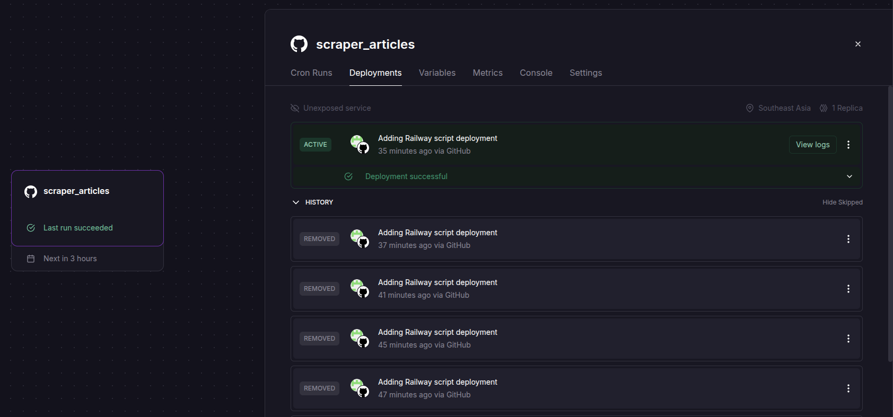
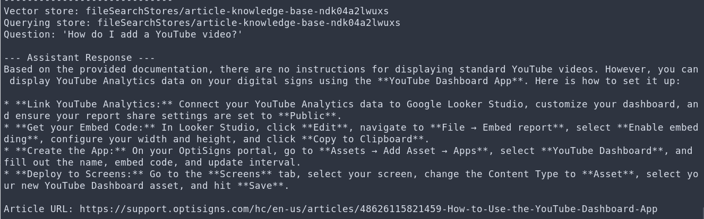
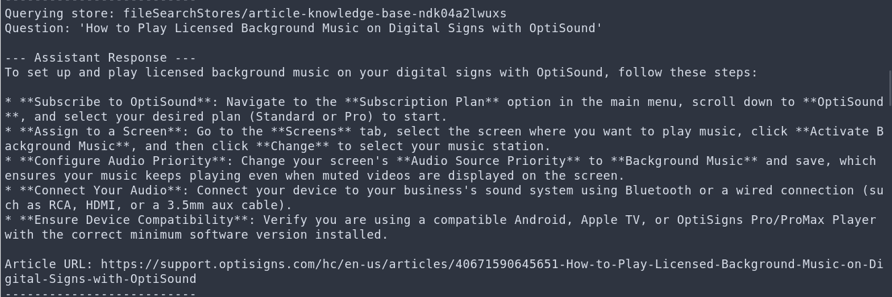

# Article Scraper

Daily scraper and uploader for Help Center articles.

The job fetches public Help Center articles, converts each article body to Markdown, detects added or updated files with content hashes, uploads only changed Markdown files to Gemini File Search, and stores generated Markdown back in this GitHub repo under `scraped_articles/`.

## Setup

### Fork this repository

1. Click **Fork** on this GitHub repository.
2. Create the fork under your own GitHub account or organization.
3. Use your forked repository for Railway deployment.

The generated Markdown files are committed back to the fork, so the Railway job needs write access to the forked repository.

### Required secrets

Create a Gemini API key and a GitHub fine-grained personal access token.

The GitHub token needs access to your forked repository with:

- `Contents: Read and write`
- `Metadata: Read-only`

For Railway, configure these service variables:

```text
API_KEY=your_gemini_api_key
GITHUB_TOKEN=your_github_personal_access_token
GITHUB_REPO=your-github-username/your-forked-repo-name
GITHUB_BRANCH=master
```

### Railway daily job

The Docker image runs `scripts/railway-cron.sh` by default.

Each scheduled run:

1. Clones this repo into `/tmp`.
2. Runs `main.py` from inside the cloned repo.
3. Creates or updates `scraped_articles/*.md`.
4. Uploads only added or updated files to Gemini File Search.
5. Commits Markdown changes back to GitHub.

Recommended Railway cron schedule:

```text
0 0 * * *
```

Railway cron uses UTC.

## Run Locally

Create a local `.env` file:

```text
API_KEY=your_gemini_api_key
```

Install dependencies:

```bash
python -m venv venv
source venv/bin/activate
pip install -r requirements.txt
```

Run the scraper locally:

```bash
python main.py
```

Run with Docker locally:

```bash
docker build -t articles-scraper .
docker run --rm \
  -e API_KEY="your_gemini_api_key" \
  -e GITHUB_TOKEN="your_github_personal_access_token" \
  -e GITHUB_REPO="your-github-username/your-forked-repo-name" \
  -e GITHUB_BRANCH="master" \
  articles-scraper
```

## Daily Job Logs

Railway job logs:




Deployment build logs:

```log
2026-07-05T20:41:15.572378339Z [inf]  scheduling build on Metal builder "builder-lvolca"
2026-07-05T20:41:19.606524627Z [inf]  unpacking archive
2026-07-05T20:41:20.023458302Z [inf]  uploading snapshot
2026-07-05T20:41:20.436621277Z [inf]  [internal] load build definition from Dockerfile
2026-07-05T20:41:20.436734517Z [inf]  [internal] load build definition from Dockerfile
2026-07-05T20:41:20.436886427Z [inf]  [internal] load build definition from Dockerfile
2026-07-05T20:41:20.503999163Z [inf]  [internal] load build definition from Dockerfile
2026-07-05T20:41:20.522619332Z [inf]  [internal] load metadata for docker.io/library/python:3.12-slim
2026-07-05T20:41:20.833870724Z [inf]  [internal] load metadata for docker.io/library/python:3.12-slim
2026-07-05T20:41:20.834540553Z [inf]  [internal] load .dockerignore
2026-07-05T20:41:20.834700504Z [inf]  [internal] load .dockerignore
2026-07-05T20:41:20.834734733Z [inf]  [internal] load .dockerignore
2026-07-05T20:41:20.900393990Z [inf]  [internal] load .dockerignore
2026-07-05T20:41:20.919063099Z [inf]  [8/8] RUN chmod +x /app/railway-cron.sh
2026-07-05T20:41:20.919064919Z [inf]  [7/8] COPY scripts/railway-cron.sh /app/railway-cron.sh
2026-07-05T20:41:20.919065479Z [inf]  [6/8] COPY main.py .
2026-07-05T20:41:20.919066059Z [inf]  [5/8] RUN pip install --no-cache-dir -r requirements.txt
2026-07-05T20:41:20.919066639Z [inf]  [4/8] COPY requirements.txt .
2026-07-05T20:41:20.919067208Z [inf]  [internal] load build context
2026-07-05T20:41:20.919067679Z [inf]  [3/8] RUN apt-get update     && apt-get install -y --no-install-recommends git ca-certificates     && rm -rf /var/lib/apt/lists/*
2026-07-05T20:41:20.919068168Z [inf]  [2/8] WORKDIR /app
2026-07-05T20:41:20.919068628Z [inf]  [1/8] FROM docker.io/library/python:3.12-slim@sha256:423ed6ab25b1921a477529254bfeeabf5855151dc2c3141699a1bfc852199fbf
2026-07-05T20:41:20.919241128Z [inf]  [1/8] FROM docker.io/library/python:3.12-slim@sha256:423ed6ab25b1921a477529254bfeeabf5855151dc2c3141699a1bfc852199fbf
2026-07-05T20:41:20.919372979Z [inf]  [internal] load build context
2026-07-05T20:41:20.932201108Z [inf]  [1/8] FROM docker.io/library/python:3.12-slim@sha256:423ed6ab25b1921a477529254bfeeabf5855151dc2c3141699a1bfc852199fbf
2026-07-05T20:41:20.932615898Z [inf]  [1/8] FROM docker.io/library/python:3.12-slim@sha256:423ed6ab25b1921a477529254bfeeabf5855151dc2c3141699a1bfc852199fbf
2026-07-05T20:41:20.932624468Z [inf]  [1/8] FROM docker.io/library/python:3.12-slim@sha256:423ed6ab25b1921a477529254bfeeabf5855151dc2c3141699a1bfc852199fbf
2026-07-05T20:41:20.933071068Z [inf]  [internal] load build context
2026-07-05T20:41:21.009964263Z [inf]  [internal] load build context
2026-07-05T20:41:21.031827182Z [inf]  [2/8] WORKDIR /app
2026-07-05T20:41:21.031828222Z [inf]  [3/8] RUN apt-get update     && apt-get install -y --no-install-recommends git ca-certificates     && rm -rf /var/lib/apt/lists/*
2026-07-05T20:41:21.031828812Z [inf]  [4/8] COPY requirements.txt .
2026-07-05T20:41:21.031829402Z [inf]  [5/8] RUN pip install --no-cache-dir -r requirements.txt
2026-07-05T20:41:21.031829902Z [inf]  [6/8] COPY main.py .
2026-07-05T20:41:21.031830462Z [inf]  [7/8] COPY scripts/railway-cron.sh /app/railway-cron.sh
2026-07-05T20:41:21.031831012Z [inf]  [8/8] RUN chmod +x /app/railway-cron.sh
2026-07-05T20:41:21.033388092Z [inf]  exporting to docker image format
2026-07-05T20:41:21.447294817Z [inf]  exporting to docker image format
2026-07-05T20:41:21.526201332Z [inf]  containerimage.digest: sha256:6d33cd558a66f636aac25b26ee28ecab6baa3795041f5b6b3f8a9930a27cef07
2026-07-05T20:41:21.526207542Z [inf]  containerimage.descriptor: eyJtZWRpYVR5cGUiOiJhcHBsaWNhdGlvbi92bmQub2NpLmltYWdlLm1hbmlmZXN0LnYxK2pzb24iLCJkaWdlc3QiOiJzaGEyNTY6NmQzM2NkNTU4YTY2ZjYzNmFhYzI1YjI2ZWUyOGVjYWI2YmFhMzc5NTA0MWY1YjZiM2Y4YTk5MzBhMjdjZWYwNyIsInNpemUiOjIzODEsImFubm90YXRpb25zIjp7Im9yZy5vcGVuY29udGFpbmVycy5pbWFnZS5jcmVhdGVkIjoiMjAyNi0wNy0wNVQyMDo0MToyMVoifSwicGxhdGZvcm0iOnsiYXJjaGl0ZWN0dXJlIjoiYW1kNjQiLCJvcyI6ImxpbnV4In19
2026-07-05T20:41:21.526210232Z [inf]  containerimage.config.digest: sha256:c0f4858d329586296a76d45f63578a23a520363230f347e5bf7c5d4907f41d81
2026-07-05T20:41:23.033627673Z [inf]  image push
```

Expected log summary:

```log
2026-07-05T20:39:46.091745289Z [err]  Cloning into '/tmp/scraper_articles_repo'...
2026-07-05T20:39:46.468274056Z [inf]  Starting Container
2026-07-05T20:39:49.198897121Z [inf]  Skipping: 53095698149011-using-the-japan-earthquake-app.md already exists!
2026-07-05T20:39:49.535022897Z [inf]  Skipping: 53028011485715-how-to-display-a-snowflake-dashboard-with-optisigns.md already exists!
2026-07-05T20:39:49.872954781Z [inf]  Skipping: 52523606879251-optisigns-digital-signage-app-for-zoom-adding-using-and-removing-the-app.md already exists!
2026-07-05T20:39:50.297911491Z [inf]  Skipping: 52412502456083-connect-google-meet-hardware-to-optisigns-digital-signage.md already exists!
2026-07-05T20:39:50.662514764Z [inf]  Skipping: 52350277262483-connect-microsoft-teams-rooms-to-optisigns-digital-signage.md already exists!
2026-07-05T20:39:51.100474746Z [inf]  Skipping: 52113036672403-room-integrations-turn-your-meeting-rooms-into-digital-signage.md already exists!
2026-07-05T20:39:51.336419115Z [inf]  Skipping: 52069065128723-connect-zoom-rooms-to-optisigns-digital-signage.md already exists!
2026-07-05T20:39:51.699322059Z [inf]  Skipping: 51343184586643-connect-cisco-webex-rooms-to-optisigns-digital-signage.md already exists!
2026-07-05T20:39:52.097690668Z [inf]  Skipping: 49039295567891-chromeos-pwa-instructions.md already exists!
2026-07-05T20:39:52.367156440Z [inf]  Skipping: 48751096814995-how-to-use-the-google-ads-dashboard-app.md already exists!
2026-07-05T20:39:52.700188703Z [inf]  Skipping: 48656950622227-how-to-use-the-google-search-console-app.md already exists!
2026-07-05T20:39:53.514475395Z [inf]  Skipping: 48626115821459-how-to-use-the-youtube-dashboard-app.md already exists!
2026-07-05T20:39:53.850475721Z [inf]  Skipping: 48241081473043-operational-schedule-troubleshooting.md already exists!
2026-07-05T20:39:54.181861438Z [inf]  Skipping: 47616485609491-how-to-use-the-optidev-app.md already exists!
2026-07-05T20:39:54.514523545Z [inf]  Skipping: 45619214182803-how-to-set-up-an-outlook-calendar-app-with-shared-permissions.md already exists!
2026-07-05T20:39:54.855802658Z [inf]  Skipping: 44890229616403-using-an-enterprise-network-802-1x-with-optisigns.md already exists!
2026-07-05T20:39:55.198887752Z [inf]  Skipping: 43657735780627-user-management-example-chain-restaurant-or-retail-store-with-multiple-locations.md already exists!
2026-07-05T20:39:55.543836610Z [inf]  Skipping: 42087942047379-getting-started-with-designer.md already exists!
2026-07-05T20:39:56.097329157Z [inf]  Skipping: 41432385864595-designer-2-0-new-features.md already exists!
2026-07-05T20:39:56.230086876Z [inf]  Skipping: 40736654972563-optisigns-pro-promax-player-troubleshooting-guide.md already exists!
2026-07-05T20:39:56.555971448Z [inf]  Skipping: 40671590645651-how-to-play-licensed-background-music-on-digital-signs-with-optisound.md already exists!
2026-07-05T20:39:57.083037040Z [inf]  Skipping: 40212027797523-disk-encryption.md already exists!
2026-07-05T20:39:57.804218735Z [inf]  Skipping: 40147900639891-optistick-troubleshooting-guide.md already exists!
2026-07-05T20:39:58.629590560Z [inf]  Skipping: 39488874989587-fixing-unexpected-screen-rotation-incorrect-orientation-with-optisigns-android-stick.md already exists!
2026-07-05T20:39:59.118747701Z [inf]  Skipping: 39250660729747-how-to-use-the-tableau-app.md already exists!
2026-07-05T20:39:59.314251628Z [inf]  Skipping: 39080869746067-handle-oauth-authentication-using-api-gateway-pre-request-configuration.md already exists!
2026-07-05T20:40:00.588190359Z [inf]  Skipping: 38062664690195-tagging-in-optisigns.md already exists!
2026-07-05T20:40:00.589145985Z [inf]  Skipping: 37966066335891-getting-started-with-an-optisigns-free-trial.md already exists!
2026-07-05T20:40:00.858092309Z [inf]  Skipping: 36911639377683-how-to-use-optisigns-with-microsoft-teams-rooms.md already exists!
2026-07-05T20:40:01.211926200Z [inf]  Skipping: 36501302096915-how-to-access-the-troubleshooting-page-of-the-optisigns-player.md already exists!
2026-07-05T20:40:01.211933580Z [inf]  Searching for Vector store display name: 'Article Knowledge Base'...
2026-07-05T20:40:01.890805448Z [inf]  Found existing store, reuse : fileSearchStores/article-knowledge-base-ndk04a2lwuxs
2026-07-05T20:40:01.890812216Z [inf]  Store created successfully. ID/Name: fileSearchStores/article-knowledge-base-ndk04a2lwuxs
2026-07-05T20:40:01.890818293Z [inf]  
2026-07-05T20:40:01.892634255Z [inf]  ⏩ [Delta-Skip]: 39488874989587-fixing-unexpected-screen-rotation-incorrect-orientation-with-optisigns-android-stick.md not changed. Skip upload.
2026-07-05T20:40:01.892645226Z [inf]  Found 30 markdown files to upload.
2026-07-05T20:40:01.892647345Z [inf]  ⏩ [Delta-Skip]: 48656950622227-how-to-use-the-google-search-console-app.md not changed. Skip upload.
2026-07-05T20:40:01.892653692Z [inf]  ⏩ [Delta-Skip]: 49039295567891-chromeos-pwa-instructions.md not changed. Skip upload.
2026-07-05T20:40:01.892660784Z [inf]  ⏩ [Delta-Skip]: 47616485609491-how-to-use-the-optidev-app.md not changed. Skip upload.
2026-07-05T20:40:01.892661805Z [inf]  ⏩ [Delta-Skip]: 40671590645651-how-to-play-licensed-background-music-on-digital-signs-with-optisound.md not changed. Skip upload.
2026-07-05T20:40:01.892667292Z [inf]  ⏩ [Delta-Skip]: 38062664690195-tagging-in-optisigns.md not changed. Skip upload.
2026-07-05T20:40:01.892672459Z [inf]  ⏩ [Delta-Skip]: 36911639377683-how-to-use-optisigns-with-microsoft-teams-rooms.md not changed. Skip upload.
2026-07-05T20:40:01.892676900Z [inf]  ⏩ [Delta-Skip]: 48751096814995-how-to-use-the-google-ads-dashboard-app.md not changed. Skip upload.
2026-07-05T20:40:01.892681175Z [inf]  ⏩ [Delta-Skip]: 45619214182803-how-to-set-up-an-outlook-calendar-app-with-shared-permissions.md not changed. Skip upload.
2026-07-05T20:40:01.892686709Z [inf]  ⏩ [Delta-Skip]: 39250660729747-how-to-use-the-tableau-app.md not changed. Skip upload.
2026-07-05T20:40:01.892692847Z [inf]  ⏩ [Delta-Skip]: 52350277262483-connect-microsoft-teams-rooms-to-optisigns-digital-signage.md not changed. Skip upload.
2026-07-05T20:40:01.892697412Z [inf]  ⏩ [Delta-Skip]: 36501302096915-how-to-access-the-troubleshooting-page-of-the-optisigns-player.md not changed. Skip upload.
2026-07-05T20:40:01.892702036Z [inf]  ⏩ [Delta-Skip]: 37966066335891-getting-started-with-an-optisigns-free-trial.md not changed. Skip upload.
2026-07-05T20:40:01.893913700Z [inf]  ⏩ [Delta-Skip]: 40212027797523-disk-encryption.md not changed. Skip upload.
2026-07-05T20:40:01.893917931Z [inf]  ⏩ [Delta-Skip]: 42087942047379-getting-started-with-designer.md not changed. Skip upload.
2026-07-05T20:40:01.893921216Z [inf]  ⏩ [Delta-Skip]: 52113036672403-room-integrations-turn-your-meeting-rooms-into-digital-signage.md not changed. Skip upload.
2026-07-05T20:40:01.893924325Z [inf]  ⏩ [Delta-Skip]: 40736654972563-optisigns-pro-promax-player-troubleshooting-guide.md not changed. Skip upload.
2026-07-05T20:40:01.893927466Z [inf]  ⏩ [Delta-Skip]: 44890229616403-using-an-enterprise-network-802-1x-with-optisigns.md not changed. Skip upload.
2026-07-05T20:40:01.893931990Z [inf]  ⏩ [Delta-Skip]: 41432385864595-designer-2-0-new-features.md not changed. Skip upload.
2026-07-05T20:40:01.893935512Z [inf]  ⏩ [Delta-Skip]: 52412502456083-connect-google-meet-hardware-to-optisigns-digital-signage.md not changed. Skip upload.
2026-07-05T20:40:01.893939322Z [inf]  ⏩ [Delta-Skip]: 48626115821459-how-to-use-the-youtube-dashboard-app.md not changed. Skip upload.
2026-07-05T20:40:01.893943240Z [inf]  ⏩ [Delta-Skip]: 53028011485715-how-to-display-a-snowflake-dashboard-with-optisigns.md not changed. Skip upload.
2026-07-05T20:40:01.893947129Z [inf]  ⏩ [Delta-Skip]: 43657735780627-user-management-example-chain-restaurant-or-retail-store-with-multiple-locations.md not changed. Skip upload.
2026-07-05T20:40:01.893951411Z [inf]  ⏩ [Delta-Skip]: 40147900639891-optistick-troubleshooting-guide.md not changed. Skip upload.
2026-07-05T20:40:01.893954697Z [inf]  ⏩ [Delta-Skip]: 39080869746067-handle-oauth-authentication-using-api-gateway-pre-request-configuration.md not changed. Skip upload.
2026-07-05T20:40:01.893958249Z [inf]  ⏩ [Delta-Skip]: 52069065128723-connect-zoom-rooms-to-optisigns-digital-signage.md not changed. Skip upload.
2026-07-05T20:40:01.895466054Z [inf]  uploaded: 0
2026-07-05T20:40:01.895476655Z [inf]  ⏩ [Delta-Skip]: 53095698149011-using-the-japan-earthquake-app.md not changed. Skip upload.
2026-07-05T20:40:01.895482918Z [inf]  Chunking Strategy: Managed automatically by Gemini File Search (Semantic Chunking).
2026-07-05T20:40:01.895486120Z [inf]  ⏩ [Delta-Skip]: 48241081473043-operational-schedule-troubleshooting.md not changed. Skip upload.
2026-07-05T20:40:01.895495105Z [inf]  -----------------------------
2026-07-05T20:40:01.895495222Z [inf]  ⏩ [Delta-Skip]: 51343184586643-connect-cisco-webex-rooms-to-optisigns-digital-signage.md not changed. Skip upload.
2026-07-05T20:40:01.895505889Z [inf]  ⏩ [Delta-Skip]: 52523606879251-optisigns-digital-signage-app-for-zoom-adding-using-and-removing-the-app.md not changed. Skip upload.
2026-07-05T20:40:01.895506522Z [inf]  Vector store: fileSearchStores/article-knowledge-base-ndk04a2lwuxs
2026-07-05T20:40:01.895513145Z [inf]  --- Ingestion Log Summary ---
2026-07-05T20:40:01.895518344Z [inf]  Total Files Embedded: 0
2026-07-05T20:40:01.895522995Z [inf]  added: 0
2026-07-05T20:40:01.895527498Z [inf]  updated: 0
2026-07-05T20:40:01.895532000Z [inf]  skipped: 30
2026-07-05T20:40:02.124025154Z [inf]  No scraped article changes to commit.
2026-07-05T20:41:31.044924340Z [inf]  Stopping Container
```

## Sample Assistant Answer

Example Markdown after upload:

### Sample Question: How do I add a YouTube video?




### Cited Url Question: How to Play Licensed Background Music on Digital Signs with OptiSound ?


